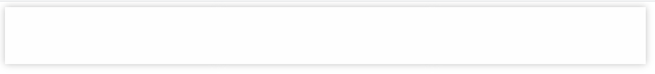

上才艺
html:
```
    <div class="foo">
        <div class="bar">
            <div class="baz"></div>
        </div>
        <div class="bar">
            <div class="baz"></div>
        </div>
        <div class="bar">
            <div class="baz"></div>
        </div>
    </div>
```
css:
```
    <style>
        .foo {
            display: flex;
        }
        .bar {
            width: 300px;
            height: 80px;
            position: relative;
            transform: translateX(0);
        }
        .baz {
            height: 100%;
            background: #fefefe;
            position: relative;
        }
        .bar::after {
            content: '';
            left: 0;
            top: 0;
            right: 0;
            bottom: 0;
            position: absolute;
            box-shadow: 0 0 10px rgba(0, 0, 0, .25);
        }
    </style>
```
就是3个盒子，.bar不加transform属性的时候，如下图:


无缝对接处的盒子阴影是不会盖到其它盒子上面的，但是如果需要制作效果，给.bar增加了transform属性，就会变成下面的样子:


实测使用z-index并不能解决这一个压盖的问题，所以采取了一个神奇办法，3d
放最终css：
```
    <style>
        .foo {
            display: flex;
            transform-style: preserve-3d;
        }
        .bar {
            width: 300px;
            height: 80px;
            position: relative;
            transform: translateX(0);
            transform-style: preserve-3d;
        }
        .baz {
            height: 100%;
            background: #fefefe;
            position: relative;
            transform: translateZ(1px);
        }
        .bar::after {
            content: '';
            left: 0;
            top: 0;
            right: 0;
            bottom: 0;
            transform: translateZ(0);
            position: absolute;
            box-shadow: 0 0 10px rgba(0, 0, 0, .25);
        }
    </style>
```
没错，我们给每一个需要调整的盒子阴影的所有父级，都增加了transform-style:preserve-3d的属性，并且盒子于盒子阴影使用translateZ来区分层级，就完美的解决了，层级关系被transform属性打垮掉的问题